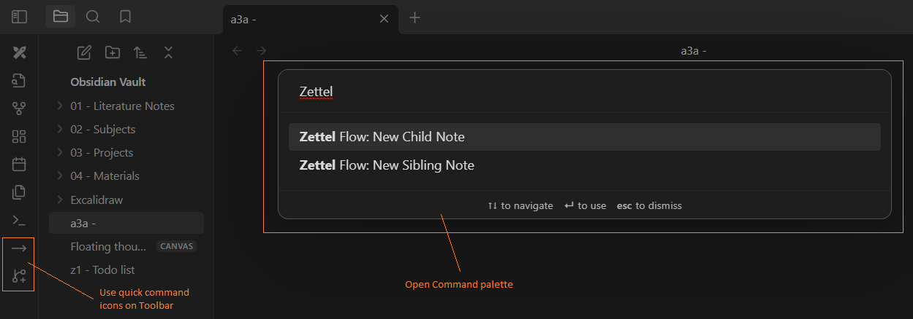

# Features

- This is an Obsidian plugin to create and name new note files using the zettelkasten method. You can choose to create a child or sibling of an opening note. For example, with an opening note named "a3a", selecting  "New sibbling note" will create a new file named "a3b", and selecting  "New child note" will create a file named "a3a1". However, this plugin does not currently work with .canvas files.
- New creating files could use the template file directly, saving nasty pausing time when writing your thinking.

# Usage 

## Format syntax
You can use the following syntax to format the names and contents of metadata files.
### Date
| Syntax | Description |
| -- | -- |
| `{{CDATE:<FORMAT>}}` | Creation time of the static file.  |
| `{{NOW:<FORMAT>}}` | Current time. |

- Replace `<FORMAT>` by a [Moment.js format](https://momentjs.com/docs/#/displaying/format/).

### Link
| Syntax | Description |
| -- | -- |
| `{{LINK}}` | Internal link like `[[image.png]]` |
| `{{EMBED}}` | Embedded link like `![[image.png]]` |

### Path
| Syntax | Description |
| -- | -- |
| `{{PATH}}` | Path of a static file. |
| `{{FULLNAME}}` | Name of a static file. |
| `{{NAME}}` | Name of a static file with extension removed. |
| `{{EXTENSION}}` | Extension of a static file. |

- You can choose between uppercase and lowercase letters by adding suffixes `:UP` and `:LOW`, respectively. For example, `{{NAME:UP}}`.

## Templater plugin support
You can also use [Templater plugin](https://github.com/SilentVoid13/Templater) to format your meta data files.
Just install Templater plugin and set `Use Templater` in the setting tab of Binary File Manager.

# Installation

## Using Obsidian

- Get it from Obsidian Community plugins

## Manually installing the plugin

- Download the latest release in .zip format and extract it.

- Copy over `main.js`, `styles.css`, `manifest.json` to your vault `VaultFolder/.obsidian/plugins/your-plugin-id/`.

# How to use this plugin?

# Community supports

- Feel free to report any bugs & issues on our Github repo: https://github.com/zokernguyen/obsidian-plugin-zettel-flow.

- We welcome any ideas and suggestions for this pluggin.

# Developing

- Run `npm install`
- Then `npm run dev`
    - The `dist\main.js` would appear for using
- For testing `npm run test`

## Hot Reload
- Install https://github.com/pjeby/hot-reload
- Create empty file `.hotreload` in the `./dist`
- Make symlink: `mklink /j /some/Vault/.obsidian/plugins/my-plugin ./dist`
    - Or put all your code into `/some/Vault/.obsidian/plugins/my-plugin`